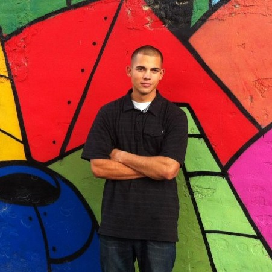
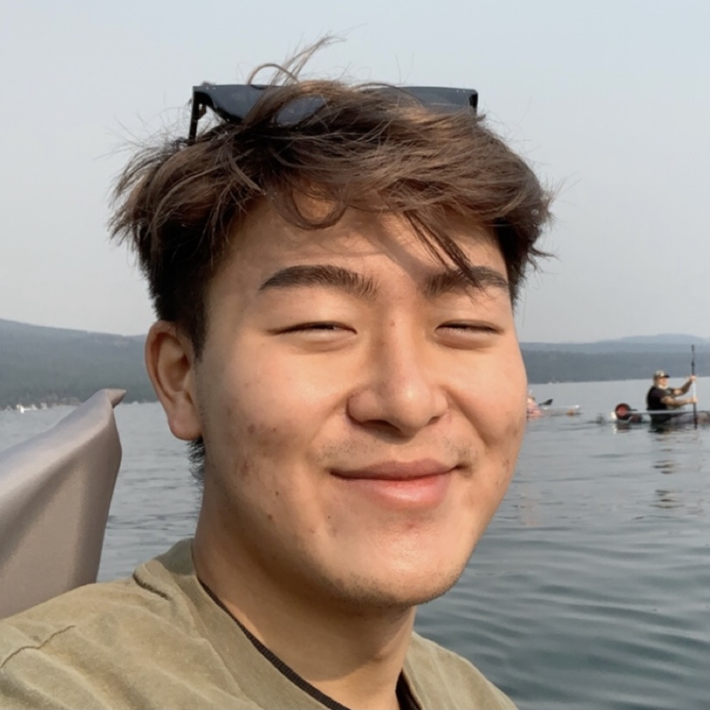

# Project Proposal 

## Hi, We're the Ocean Pollution Posse. 

Our mission this quarter is to analyze plastic pollutants in the ocean. According to George Leonard, the chief scientist at the Ocean Conservancy, *“At least half of [...ocean plastic waste] is not consumer plastics, which are central to much of the current debate, but fishing gear.”* This fact surprised our team and inspired us to look deeper into the connection between the fishing industry and plastic in the ocean.

## Meet the Team!

Hi, I'm Julia Wood and I will be the data visualization specialist for our team. Besides data visualization, I will also conduct data analysis and help put our website together. I am really looking forward to working on this project because I am passionate about protecting our oceans and uncovering spatial trends using web mapping!    

I'm Eli and I will be the web specialist for our team. I will be managing the functionality of our site, writing and reviewing code, and helping out the team with other aspects of the project as needed.
   

Hello! I'm Derek and I will be the UX designer for our team. In addition to designing the site, I plan to help construct of a compelling narrative and plan to implement Python interactive mapping knowledge from DH140. I hope to discover exciting, new findings with the team!
   

**Overview**: Introduce the group project by stating what it is that you are investigating, and why this is a matter of importance.

As we know, the human species has drastically changed the world 

Our team aims to investigate ... "fishings impact on the climate, plastic in the ocean"

**Methodology**: Introduce web mapping as a methodology of inquiry, and explain why this medium was chosen.

**Workflow**: Provide a workflow diagram/table that outlines the steps/phases the project will take from start to completion. Include dates/weeks as milestones.

| Timeline  | Goals |
| ------------- | ------------- |
| Week 2  | Project Proposal  |
| Content Cell  | Content Cell  |

**Technical scope**: Introduce the technologies that project will use (Git, Leaflet, HTML, Javascript, etc) and what role each one will play (a diagram might be helpful)

We will use the following technologies in our project: Git, HTML

**Data**: Introduce at least two datasets that will be included in the project (include links as necessary). Make sure the data is "mappable" either by manual data entry, through an API, or by downloading it.
